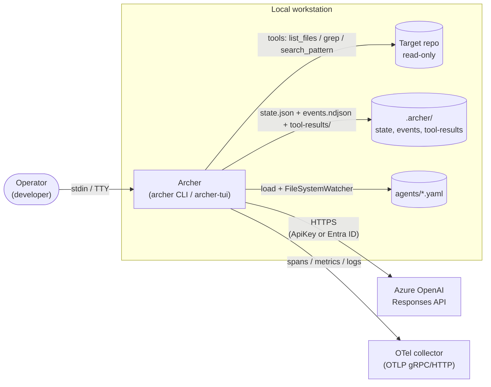
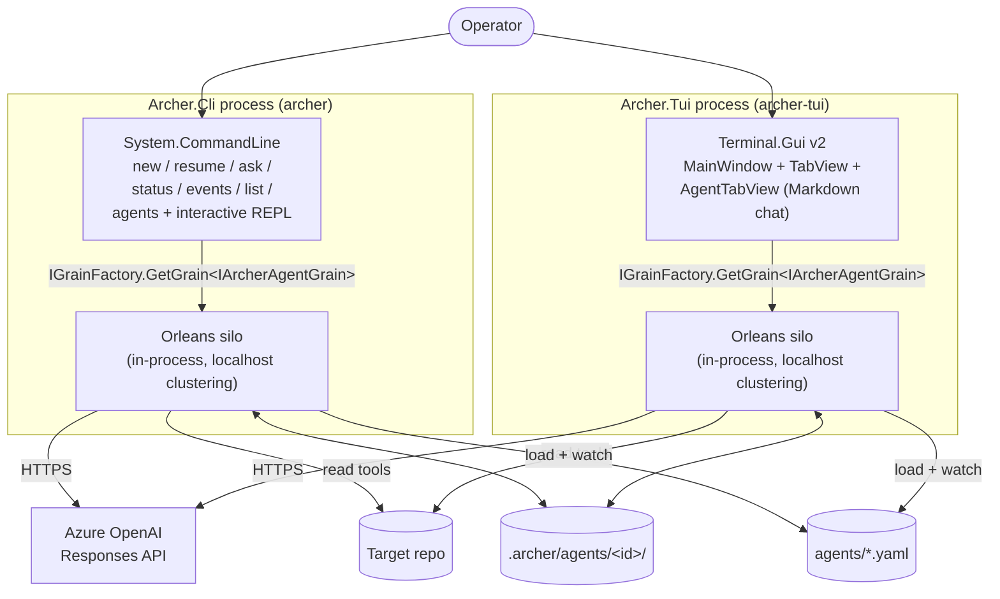
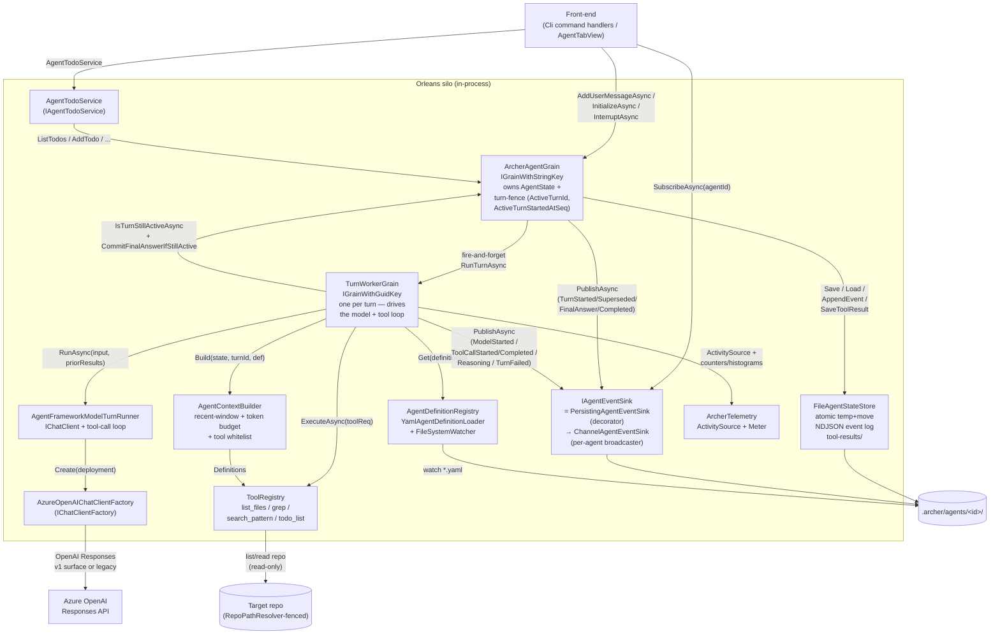
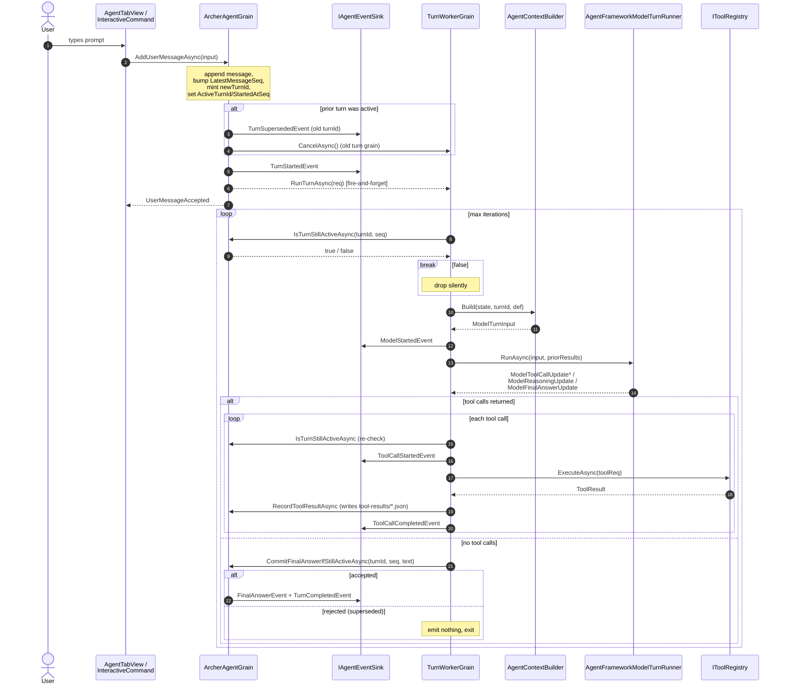

## Overview

Archer is a .NET 10 actor-based agent framework. It runs YAML-defined LLM agents
as Microsoft Orleans grains in a single in-process silo, drives them through
Azure OpenAI's Responses API via `Microsoft.Extensions.AI` / `Microsoft.Agents.AI`,
and surfaces their work through two front-ends — a `System.CommandLine` CLI
(`archer`) and a Terminal.Gui v2 TUI (`archer-tui`) — that both co-host the silo.
State lives on disk as JSON + NDJSON under `.archer/`, definitions hot-reload
from `agents/*.yaml`, and the whole thing is instrumented with OpenTelemetry.

## C4 — Context



The user is the only human actor. Archer never writes to the target repo — the
shipped tool set (`list_files`, `grep`, `search_pattern`, `todo_list`) is read-only
by construction (`src/Archer.Tools/`). Telemetry export is optional: if
`Otel:Endpoint` is unset the collector arrow disappears
(`src/Archer.Host/OtelConfig.cs:62`).

## C4 — Container



There is no separate silo process. Each front-end builds a host with
`hostBuilder.ConfigureArcher(...)` (`src/Archer.Host/ArcherHostBuilder.cs:22`)
which calls `silo.UseLocalhostClustering()`
(`src/Archer.Host/ArcherHostBuilder.cs:51`) — the silo lives in the same
process as the UI. Both front-ends reference the same `Archer.Host`, `Archer.Actors`,
`Archer.Persistence`, `Archer.Events`, `Archer.Tools`, and `Archer.Model` projects
(`src/Archer.Cli/Archer.Cli.csproj:18-26`,
`src/Archer.Tui/Archer.Tui.csproj:17-25`). The TUI additionally redirects logs to
`.archer/logs/tui-*.log` so they don't scribble over the screen
(`src/Archer.Tui/Program.cs:74-92`).

## C4 — Component



The trick that makes the worker safe to kill at any point: it never mutates
`AgentState` directly. The grain owns the state; the worker only reads (via the
store), runs the model, and asks the grain to commit results. This is the seam
between `TurnWorkerGrain.RunTurnAsync` (`src/Archer.Actors/Grains/TurnWorkerGrain.cs:58-265`)
and `ArcherAgentGrain.CommitFinalAnswerIfStillActiveAsync`
(`src/Archer.Actors/Grains/ArcherAgentGrain.cs:181-222`).

## Turn lifecycle



`AddUserMessageAsync` (`src/Archer.Actors/Grains/ArcherAgentGrain.cs:82-120`)
is the single entry point for user input from both the TUI
(`src/Archer.Tui/Ui/AgentTabView.cs:178`) and the CLI REPL
(`src/Archer.Cli/Commands/InteractiveCommand.cs:104`). It does four things
atomically inside the grain's single-threaded turn: appends the message, mints
a new `TurnId`, supersedes the previous turn if any, and schedules a fresh
`TurnWorkerGrain` keyed by the new `TurnId`
(`src/Archer.Actors/Grains/ArcherAgentGrain.cs:295-300`). The worker is
fire-and-forget — it owns its own lifecycle and emits events back through the
shared sink.

## Layering rules

Strict acyclic layering, verified by reading every csproj:

| Project | References | Notes |
| --- | --- | --- |
| `Archer.Domain` | (none) | `Archer.Domain.csproj:1-2` — pure POCOs. |
| `Archer.Application` | `Domain`, MEAI.Abstractions | `Archer.Application.csproj:3-10` — interfaces only. |
| `Archer.Persistence` | `Domain`, `Application`, YamlDotNet | `Archer.Persistence.csproj:3-16`. |
| `Archer.Events` | `Domain`, `Application` | `Archer.Events.csproj:3-10`. |
| `Archer.Tools` | `Domain`, `Application` | `Archer.Tools.csproj:3-16`. |
| `Archer.Model` | `Domain`, `Application`, Azure.AI.OpenAI, Microsoft.Agents.AI | `Archer.Model.csproj:7-27`. |
| `Archer.Actors` | `Domain`, `Application`, Orleans.Sdk | `Archer.Actors.csproj:3-18`. |
| `Archer.Host` | `Domain`, `Application`, `Actors`, `Persistence`, `Events`, `Tools`, `Model` + Orleans.Server + OTel | `Archer.Host.csproj:8-33`. |
| `Archer.Cli` | `Domain`, `Application`, `Host`, `Actors`, `Events`, `Persistence`, `Tools`, `Model` | `Archer.Cli.csproj:18-26`. |
| `Archer.Tui` | same set as Cli | `Archer.Tui.csproj:17-25`. |

Two invariants follow:

1. `Domain` and `Application` know nothing about Orleans, files, or HTTP.
   Anything reusable from another front-end (a hypothetical web UI) lives there.
2. Adapters (`Persistence`, `Events`, `Tools`, `Model`, `Actors`) depend only on
   `Application` interfaces. There is no adapter-to-adapter reference. The
   composition root is `Archer.Host` (and `Archer.Cli` / `Archer.Tui` which
   reference it).

## Concurrency & turn fencing

Orleans gives each grain single-threaded execution by default, so `AgentState`
mutations on `ArcherAgentGrain` never race
(`src/Archer.Actors/Grains/ArcherAgentGrain.cs:13`,
`src/Archer.Actors/Grains/TurnWorkerGrain.cs:20-22`). The hard problem is
**stale work**: a slow turn is still running when the user types a new message.

Archer solves this with a **double-key fence** stored on `AgentState`:

```csharp
public Guid? ActiveTurnId { get; set; }
public long?  ActiveTurnStartedAtSeq { get; set; }

public bool IsTurnActive(Guid turnId, long messageSeq) =>
    ActiveTurnId == turnId && ActiveTurnStartedAtSeq == messageSeq;
```

(`src/Archer.Domain/Agents/AgentState.cs:10-20`). A turn is "live" only when both
keys still match — the turn id (a fresh `Guid` per user message) and the
sequence number of the user message that started it. Every user message bumps
both values inside the grain (`ArcherAgentGrain.cs:99-101`), so the previous
turn is implicitly invalidated.

The worker re-checks the fence before each side-effect:

| Checkpoint | Code |
| --- | --- |
| Top of every iteration | `TurnWorkerGrain.cs:82` |
| After the model returns | `TurnWorkerGrain.cs:149` |
| Before each tool call | `TurnWorkerGrain.cs:176` |
| After each tool call, before recording the result | `TurnWorkerGrain.cs:226` |
| Final-answer commit | `ArcherAgentGrain.cs:189` (atomic check-then-commit inside the grain) |

If any check fails the worker simply returns. The final-answer commit is the
strongest fence: `CommitFinalAnswerIfStillActiveAsync` runs the
`IsTurnActive(...)` test inside the grain's own turn, so a superseding
`AddUserMessageAsync` cannot interleave between check and commit
(`ArcherAgentGrain.cs:181-222`). When the commit is rejected the worker logs
"Final-answer commit rejected by agent (superseded)" and increments
`archer.turns.superseded` (`TurnWorkerGrain.cs:167-170`). On supersession,
`ArcherAgentGrain.AddUserMessageAsync` also calls
`TryCancelWorkerAsync(stale)` which signals the prior worker's CTS via
`ITurnWorkerGrain.CancelAsync` (`ArcherAgentGrain.cs:113`,
`TurnWorkerGrain.cs:267-271`) — best-effort cancellation, never load-bearing.

This is what "latest-turn-wins" means in Archer: at most one turn ever produces
events that mutate state; older work is allowed to run to completion in memory
but its results are dropped at the commit boundary.

## Event pipeline

`IAgentEventSink` (`src/Archer.Application/Events/IAgentEventSink.cs:5-10`) has
exactly two methods: `PublishAsync` and `SubscribeAsync`. The wiring in
`AddArcherEvents` (`src/Archer.Events/EventsServiceCollectionExtensions.cs:15-30`)
composes two implementations:

```
ArcherAgentGrain / TurnWorkerGrain
        │ PublishAsync(evt)
        ▼
PersistingAgentEventSink   ── append NDJSON to .archer/agents/<id>/events.ndjson
        │ delegates SubscribeAsync + PublishAsync
        ▼
ChannelAgentEventSink      ── one Channel<AgentEvent> per subscriber, broadcast
        │ yields events
        ▼
TUI AgentSession.PumpAsync  /  CLI EventRenderer.Render
```

`ChannelAgentEventSink`
(`src/Archer.Events/ChannelAgentEventSink.cs:14-93`) keeps a per-`AgentId`
`AgentBroadcaster`. Each subscriber gets a fresh unbounded `Channel` and
unsubscribes by cancelling the enumerator. Publishing fans out via
`channel.Writer.TryWrite` — a backed-up subscriber doesn't block publishers
(unbounded), it just keeps growing.

`PersistingAgentEventSink`
(`src/Archer.Events/PersistingAgentEventSink.cs:13-45`) is a thin decorator: it
calls the inner sink first, then appends the event to NDJSON. Persistence
failures are logged at warning level and swallowed
(`PersistingAgentEventSink.cs:38-41`) — the in-memory stream is the source of
truth for the live UI; the file is the audit log.

The event types themselves are sealed records under `AgentEvent`
(`src/Archer.Domain/Events/AgentEvent.cs`): `TurnStartedEvent`,
`ModelStartedEvent`, `ToolCallStartedEvent`, `ToolCallCompletedEvent`,
`ReasoningEvent`, `SummaryEvent`, `FinalAnswerEvent`, `TurnSupersededEvent`,
`TurnCompletedEvent`, `TurnFailedEvent`. Each carries `AgentId`, `TurnId`,
`CreatedAtUtc`, and a string `Kind` discriminator for NDJSON deserialization.

## Persistence

`FileAgentStateStore`
(`src/Archer.Persistence/FileAgentStateStore.cs:12-165`) lays out one directory
per agent under `${StateDirectory}/agents/<agentId>/`, where `StateDirectory`
defaults to `.archer` (`FileAgentStateStoreOptions.cs:8`):

```
.archer/
  agents/
    <agent-id>/
      state.json                # full AgentState snapshot, atomic temp+move
      events.ndjson             # one JSON event per line, append-only
      tool-results/
        <turnId>-<index>-<toolName>.json
```

Three operations matter:

- **`SaveAsync`** writes `state.json.tmp`, flushes, then `File.Move(..., overwrite: true)`
  under a process-wide `SemaphoreSlim _ioLock`
  (`FileAgentStateStore.cs:58-82`). On POSIX the move is atomic; readers never
  see a partial file.
- **`AppendEventAsync`** opens the NDJSON in `FileMode.Append` with
  `FileShare.Read` and writes one JSON line under the same lock
  (`FileAgentStateStore.cs:90-116`). Compact serialization (`JsonOptions.Compact`)
  keeps lines on a single physical line.
- **`SaveToolResultAsync`** stores each result as a separate file
  named `${turnId:N}-${index:D3}-${toolName}.json`
  (`FileAgentStateStore.cs:118-136`). Sanitization replaces non-alphanum chars
  with `_`. This keeps the in-memory `AgentState` light — the bulky tool
  payloads are reachable from `events.ndjson` (which records `Summary` +
  `ResultItemCount`) and the dedicated files.

`AgentId.IsValid` is checked by `AgentDirectory`
(`FileAgentStateStore.cs:28-33`) so callers cannot escape the state root with a
path-traversing id.

`ListAgentsAsync` (`FileAgentStateStore.cs:138-153`) drives `archer list` —
it enumerates `${StateDirectory}/agents/` and filters by `AgentId.IsValid`.

## Hot-reload

`AgentDefinitionRegistry`
(`src/Archer.Persistence/Agents/AgentDefinitionRegistry.cs:13-227`) scans every
configured directory for `*.yaml` (top-level only, `SearchOption.TopDirectoryOnly`,
`AgentDefinitionRegistry.cs:67`) at startup, then attaches one
`FileSystemWatcher` per directory
(`AgentDefinitionRegistry.cs:75-104`). Editors typically emit a flurry of events
on save (rename + create + change), so each path goes through
`DebouncedReload` which coalesces them inside a 250 ms window
(`AgentDefinitionRegistry.cs:15`, `:106-131`).

Two definitional rules:

1. **First-write-wins by directory order.** The host registers two directories:
   `${cwd}/agents` and `${AppContext.BaseDirectory}/agents`
   (`src/Archer.Host/ArcherHostBuilder.cs:64-68`). If two YAML files declare
   the same `id`, the one from the directory with the lower index wins; the
   later one is logged as ignored
   (`AgentDefinitionRegistry.cs:148-159`). This lets a checked-in default
   coexist with a user override.
2. **Snapshot reads, mutating writes.** Mutations go through `_gate` (a `Lock`)
   and a `ConcurrentDictionary<string, Entry>`; readers get an
   `IReadOnlyList<AgentDefinition>` snapshot rebuilt on every change
   (`AgentDefinitionRegistry.cs:21-44`, `:205-208`). The `Changed` event fires
   after the registry has mutated, so subscribers reading `Get` / `All` see the
   new state.

Removals only drop an entry whose `(Path, DirIndex)` still matches the file
that was deleted (`AgentDefinitionRegistry.cs:176-203`) — deleting a low-priority
duplicate doesn't yank the high-priority winner. `Dispose` shuts down all
watchers and any pending debounce CTS
(`AgentDefinitionRegistry.cs:210-224`).

The shipped definition `agents/code-scout.yaml` exercises every YAML knob —
`model.deployment`, `model.maxCompletionTokens`, `reasoning.effort`,
`tools` whitelist, `context.recentMessageWindow`, `context.pinFirstMessage`,
`interruption: hard` — and `AgentContextBuilder.Build`
(`src/Archer.Model/AgentFramework/AgentContextBuilder.cs:28-47`) consumes them
on every model call, so reloading the YAML changes the next turn's behaviour
without restart.

## Further reading

- `/docs/INTERNALS.md` — implementation details: serializer setup, Orleans
  deadlines, secret redaction, RepoPathResolver, YAML schema specifics.
- `/docs/TELEMETRY.md` — `ArcherTelemetry` source/meter inventory, OTel
  configuration knobs (`Otel:Endpoint`, `Otel:Protocol`,
  `Otel:ConsoleExporter`), and example collector setups.
