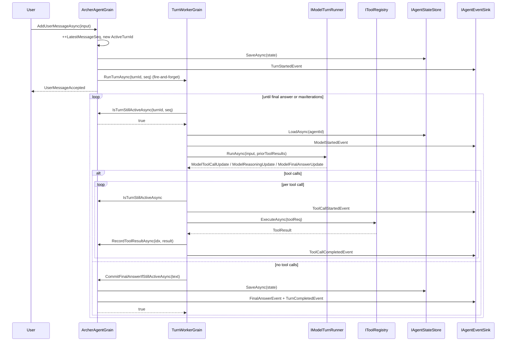

## Archer Internals

How a turn actually runs end-to-end. This is the guide for changing the
framework itself; for using it, see [CONFIGURATION.md](./CONFIGURATION.md) and
[AGENT_DEFINITIONS.md](./AGENT_DEFINITIONS.md). For tools see
[TOOLS.md](./TOOLS.md). Project layout is in
[ARCHITECTURE.md](./ARCHITECTURE.md).

---

## Turn lifecycle

Two grains cooperate per agent. `ArcherAgentGrain` (keyed by `agentId` string)
owns the durable state and is the only writer of `AgentState`.
`TurnWorkerGrain` (keyed by `turnId` `Guid`, so a fresh grain per turn) drives
the model loop.

The contract: the agent grain is the **system of record** and the only
authority on whether a turn is "still alive"; the worker grain checks that
authority before every effect that would mutate user-visible state.



**Step-by-step references:**

1. A new user message arrives at
   [`ArcherAgentGrain.AddUserMessageAsync` (`ArcherAgentGrain.cs:82-120`)](../src/Archer.Actors/Grains/ArcherAgentGrain.cs#L82-L120).
   It captures `supersededTurn = _state.ActiveTurnId`, increments
   `LatestMessageSeq`, appends the message, mints a new `ActiveTurnId`, sets
   `ActiveTurnStartedAtSeq = seq`, persists, publishes `TurnSupersededEvent`
   for any in-flight prior turn, then schedules a `TurnWorkerGrain` for the
   *new* turn (lines 116-118).

2. Worker entry is
   [`TurnWorkerGrain.RunTurnAsync` (`TurnWorkerGrain.cs:58-265`)](../src/Archer.Actors/Grains/TurnWorkerGrain.cs#L58-L265).
   It opens its own cancellation source, starts an `archer.turn` activity, and
   loops up to `TurnWorkerOptions.MaxIterations` (default 9999, lines 80-252).

3. **Three fence checkpoints per iteration**. Before reading state
   (line 82), after the model call (line 149), before each tool dispatch
   (line 176), and after each tool dispatch (line 226), the worker calls
   [`IsTurnStillActiveAsync` (`ArcherAgentGrain.cs:151-155`)](../src/Archer.Actors/Grains/ArcherAgentGrain.cs#L151-L155),
   which compares `(turnId, messageSeq)` against `(_state.ActiveTurnId,
   _state.ActiveTurnStartedAtSeq)` via
   [`AgentState.IsTurnActive` (`AgentState.cs:19-20`)](../src/Archer.Domain/Agents/AgentState.cs#L19-L20).
   Any mismatch ⇒ silent return; the worker drops its work without persisting
   anything.

4. The model is invoked through `_modelRunner.RunAsync(input, priorResults, ct)`
   (line 118), and updates are streamed in. Tool calls are buffered into a
   list rather than executed inline; reasoning updates are republished as
   `ReasoningEvent`s.

5. **No tool calls ⇒ commit**. When the model returns no `FunctionCallContent`,
   the worker calls
   [`CommitFinalAnswerIfStillActiveAsync` (`ArcherAgentGrain.cs:181-222`)](../src/Archer.Actors/Grains/ArcherAgentGrain.cs#L181-L222).
   That method re-checks the fence (line 189); if still active it appends the
   assistant message, clears `ActiveTurnId`, persists, and emits
   `FinalAnswerEvent` + `TurnCompletedEvent`. If superseded it returns `false`
   and the worker logs a `TurnsSuperseded` counter (TurnWorkerGrain.cs:167-170).

6. **Tool calls ⇒ execute**. Each call goes through `IToolRegistry.ExecuteAsync`
   (line 212). The result is recorded via `RecordToolResultAsync`
   (line 231) — that path delegates to
   [`IAgentStateStore.SaveToolResultAsync` (`ArcherAgentGrain.cs:174-179`)](../src/Archer.Actors/Grains/ArcherAgentGrain.cs#L174-L179)
   which writes a JSON file under `tool-results/`. The result is also added
   to `priorResults` so the next iteration's `BuildMessages` can stitch them
   into the conversation (see [Model runner](#model-runner)).

7. **Hard cap.** If the loop exits via the `for` exhausting all iterations,
   `PublishFailureAsync` emits a `TurnFailedEvent` with
   `"Max tool iterations exceeded without a final answer."` (line 254).

---

## Turn fencing — "latest-turn-wins"

The fence is a **double-key**: every commit must match both
`ActiveTurnId` (`Guid`) and `ActiveTurnStartedAtSeq` (`long`). The
`AgentState.IsTurnActive` predicate is a strict equality on both:

```csharp
// src/Archer.Domain/Agents/AgentState.cs:19-20
public bool IsTurnActive(Guid turnId, long messageSeq) =>
    ActiveTurnId == turnId && ActiveTurnStartedAtSeq == messageSeq;
```

Why two keys? `ActiveTurnId` alone identifies the turn, but the seq is what
guarantees ordering across rapid-fire user messages. If a user types twice
within the same tick, both turns get distinct GUIDs *and* distinct
`StartedAtSeq` values, so even a hash collision is harmless.

**Promotion of a new turn** in
[`ArcherAgentGrain.AddUserMessageAsync` (`ArcherAgentGrain.cs:82-120`)](../src/Archer.Actors/Grains/ArcherAgentGrain.cs#L82-L120):

```csharp
var supersededTurn = _state!.ActiveTurnId;          // capture old fence
_state.LatestMessageSeq++;
var seq = _state.LatestMessageSeq;
_state.Messages.Add(new AgentMessage { Seq = seq, ... });

var newTurnId = Guid.NewGuid();
_state.ActiveTurnId = newTurnId;                    // bump
_state.ActiveTurnStartedAtSeq = seq;                // bump
_state.UpdatedAtUtc = now;

if (supersededTurn is { } stale && stale != newTurnId)
{
    await _events.PublishAsync(new TurnSupersededEvent { ... });
    await TryCancelWorkerAsync(stale);              // best-effort cancel
}

await SaveAndPublishTurnStartedAsync(newTurnId);
ScheduleWorker(newTurnId, seq);
```

`TryCancelWorkerAsync` is best-effort
([`ArcherAgentGrain.cs:302-313`](../src/Archer.Actors/Grains/ArcherAgentGrain.cs#L302-L313))
— it asks the prior `TurnWorkerGrain` to cancel its `_cts`. The whole design
**doesn't depend on cancellation arriving**: the prior worker can keep running
and even reach its `CommitFinalAnswerIfStillActiveAsync` call, but the fence
mismatch causes the commit to silently no-op. That's the "latest-turn-wins"
guarantee — the agent state can never regress to a superseded turn's answer.

The reciprocal check on the worker side, in
[`CommitFinalAnswerIfStillActiveAsync` (`ArcherAgentGrain.cs:189-192`)](../src/Archer.Actors/Grains/ArcherAgentGrain.cs#L189-L192):

```csharp
if (!_state!.IsTurnActive(turnId, messageSeq))
{
    return false;        // worker observes false, logs TurnsSuperseded
}
```

The worker's response to `false` is in
[`TurnWorkerGrain.cs:160-170`](../src/Archer.Actors/Grains/TurnWorkerGrain.cs#L160-L170):
emit a `TurnsSuperseded` counter, log debug, and return — no events, no state
change, no error to the user.

`InterruptAsync` ([`ArcherAgentGrain.cs:122-146`](../src/Archer.Actors/Grains/ArcherAgentGrain.cs#L122-L146))
uses the same machinery without bumping `LatestMessageSeq`: it simply nulls
out `ActiveTurnId` and `ActiveTurnStartedAtSeq`, fires `TurnSupersededEvent`,
and tries to cancel the worker. Any subsequent commit by that worker fails
the fence (`null != someGuid`) and is dropped.

---

## Event flow

The `AgentEvent` hierarchy is
[`src/Archer.Domain/Events/AgentEvent.cs`](../src/Archer.Domain/Events/AgentEvent.cs).
Each event carries `AgentId`, `TurnId`, `CreatedAtUtc`, and a constant
`Kind` discriminator (used as JSON `"$type"` plumbing in NDJSON).

| Event                    | Emitted by (file:line)                                           | Meaning                                                |
| ------------------------ | ---------------------------------------------------------------- | ------------------------------------------------------ |
| `TurnStartedEvent`       | `ArcherAgentGrain.cs:286` (via `SaveAndPublishTurnStartedAsync`) | A new turn just took ownership.                        |
| `ModelStartedEvent`      | `TurnWorkerGrain.cs:106-112`                                     | Worker is about to call the model.                     |
| `ToolCallStartedEvent`   | `TurnWorkerGrain.cs:181-189`                                     | Tool dispatch begins.                                  |
| `ToolCallCompletedEvent` | `TurnWorkerGrain.cs:232-244`                                     | Tool dispatch finished (success or failure).           |
| `ReasoningEvent`         | `TurnWorkerGrain.cs:128-135`                                     | Model emitted a reasoning summary chunk.               |
| `SummaryEvent`           | (consumer-emitted, persisted via `AppendTurnEventAsync:161-170`) | Free-form summary stored on `AgentState.Summaries`.    |
| `FinalAnswerEvent`       | `ArcherAgentGrain.cs:208-213`                                    | Assistant message has been committed.                  |
| `TurnCompletedEvent`     | `ArcherAgentGrain.cs:215-220`                                    | The turn loop ended cleanly.                           |
| `TurnSupersededEvent`    | `ArcherAgentGrain.cs:106-112, 136-142`                          | A new user message or interrupt invalidated this turn. |
| `TurnFailedEvent`        | `TurnWorkerGrain.PublishFailureAsync:273-284`                    | Unrecoverable error.                                   |

**Sink topology.** All publishers hold an `IAgentEventSink`. Two
implementations exist and they layer:

- [`ChannelAgentEventSink` (`ChannelAgentEventSink.cs`)](../src/Archer.Events/ChannelAgentEventSink.cs)
  is the in-process pub/sub. It maintains one `AgentBroadcaster` per
  `AgentId` (`ConcurrentDictionary<string, AgentBroadcaster>`, line 16).
  Each broadcaster owns a `ConcurrentDictionary<Guid, Channel<AgentEvent>>`
  of subscribers (line 44). `PublishAsync` does a non-blocking `TryWrite`
  into every subscriber's channel (lines 48-54) — slow consumers don't
  back-pressure publishers because the channels are unbounded
  (`Channel.CreateUnbounded`, line 60). Single-reader, multi-writer
  configuration on each subscriber channel.

- [`PersistingAgentEventSink` (`PersistingAgentEventSink.cs`)](../src/Archer.Events/PersistingAgentEventSink.cs)
  is a decorator. `PublishAsync` first calls the inner sink, then appends
  the event to the agent's NDJSON event log via
  `IAgentStateStore.AppendEventAsync` (lines 32-41). Persistence failures
  are logged at warning level and **swallowed** (line 39) — they never
  break the in-memory subscribers, which is the right tradeoff for an
  observability log.

The decorator is wired only when an `IAgentStateStore` is present, in
[`EventsServiceCollectionExtensions.cs:18-28`](../src/Archer.Events/EventsServiceCollectionExtensions.cs#L18-L28):

```csharp
services.AddSingleton<IAgentEventSink>(sp =>
{
    var inner = sp.GetRequiredService<ChannelAgentEventSink>();
    var store = sp.GetService<IAgentStateStore>();
    if (store is null) return inner;
    var logger = sp.GetRequiredService<ILogger<PersistingAgentEventSink>>();
    return new PersistingAgentEventSink(inner, store, logger);
});
```

So in a normal host, every event lands in two places: the in-memory channel
fan-out (consumed by the TUI / CLI subscribers via
`IAgentEventSink.SubscribeAsync(agentId, ct)`) **and** the on-disk
`events.ndjson` for replay/audit.

---

## Context building

[`AgentContextBuilder.cs`](../src/Archer.Model/AgentFramework/AgentContextBuilder.cs)
turns durable state plus an `AgentDefinition` into the `ModelTurnInput` that
the runner consumes.

Two knobs come from the YAML and shape what the model sees:

**1. Recent-message window** (lines 76-111). Budget is computed as a
percentage of the model's declared context window:

```csharp
var contextTokens = definition.Model.ContextWindowTokens ?? DefaultContextWindowTokens; // 128_000
var budgetTokens = Math.Max(1, definition.Context.RecentMessageWindow.RoundUp(contextTokens));
```

`Percentage.RoundUp` does `(int)Math.Ceiling(Fraction * total)`
([`AgentDefinition.cs:97`](../src/Archer.Domain/Agents/AgentDefinition.cs#L97)),
so a 30% window of a 128k-token context = 38_400 tokens (rounded up at the
ceiling). The picker then walks newest-first, summing
`ApproximateTokens(msg) = max(1, msg.Content.Length / 4)`
([`AgentContextBuilder.cs:113-114`](../src/Archer.Model/AgentFramework/AgentContextBuilder.cs#L113-L114)) — the
`CharsPerToken = 4` constant on line 16 — and stops once `used + cost >
budgetTokens` (and at least one message is in the picked list, so a single
oversized message can't shut out the whole context).

**Pin-first-message** (lines 105-108) is on by default
(`ContextProfile.PinFirstMessage = true`,
[`AgentDefinition.cs:65`](../src/Archer.Domain/Agents/AgentDefinition.cs#L65)).
After the budget walk, if the very first message in `state.Messages` isn't
already in the picked window, it's prepended. This keeps the original task
description in scope even on long conversations.

**2. Tool whitelist** (`FilterToolsByDefinition`, lines 116-124):

```csharp
private IReadOnlyList<ToolDefinition> FilterToolsByDefinition(IReadOnlyList<string> allowed)
{
    if (allowed.Count == 0) return _tools.Definitions;     // empty = all tools
    var allowedSet = new HashSet<string>(allowed, StringComparer.Ordinal);
    return [.. _tools.Definitions.Where(d => allowedSet.Contains(d.Name))];
}
```

So the model literally cannot see — and therefore cannot call — a tool that
isn't on `definition.Tools`. Combined with `additionalProperties: false` in
each tool's schema, this is the agent's permission boundary.

The system prompt is built in `BuildInstructions` (lines 49-74): the YAML
`instructions` come first; then `Repository root: <path>`; then a
`Current TODOs:` block if any todos exist; then the latest summary if any.

---

## Model runner

[`AgentFrameworkModelTurnRunner.cs`](../src/Archer.Model/AgentFramework/AgentFrameworkModelTurnRunner.cs)
implements `IModelTurnRunner` on top of Microsoft.Extensions.AI's `IChatClient`
(the same primitive `Microsoft.Agents.AI.ChatClientAgent` wraps internally).
The class comment at lines 16-19 spells out the rationale: keep the tool-call
loop *outside* the runner so the worker grain can fence around every tool
invocation.

**Client construction.** The runner depends on `IChatClientFactory`. The
production implementation,
[`AzureOpenAIChatClientFactory.cs`](../src/Archer.Model/AgentFramework/AzureOpenAIChatClientFactory.cs),
supports two endpoint shapes and ends with the same line:

```csharp
return responsesClient.AsIChatClient(deployment);
```

— the v1 surface
([`AzureOpenAIChatClientFactory.cs:81`](../src/Archer.Model/AgentFramework/AzureOpenAIChatClientFactory.cs#L81))
or the legacy deployments shape (line 98). The Azure OpenAI Responses API
underlies both. Auth is either an `ApiKey` (added via the
`AzureApiKeyHeaderPolicy` per-call policy at lines 64, 127-144) or an Entra
bearer token from `DefaultAzureCredential` (line 69).

**ChatOptions wiring** ([`AgentFrameworkModelTurnRunner.cs:67-81`](../src/Archer.Model/AgentFramework/AgentFrameworkModelTurnRunner.cs#L67-L81)):

```csharp
var chatOptions = new ChatOptions
{
    Tools = [.. input.Tools.Select(BuildTool)],
    ModelId = input.ModelDeployment,
    ToolMode = ChatToolMode.Auto,
    MaxOutputTokens = input.MaxCompletionTokens ?? _options.MaxCompletionTokens,
    RawRepresentationFactory = _ => new CreateResponseOptions
    {
        ReasoningOptions = new ResponseReasoningOptions
        {
            ReasoningEffortLevel = MapEffort(effort),
            ReasoningSummaryVerbosity = MapSummary(summary),
        },
    },
};
```

`RawRepresentationFactory` is the Microsoft.Extensions.AI escape hatch into
provider-specific options — here we pipe `CreateResponseOptions` through to
the OpenAI SDK so reasoning effort/summary verbosity from the YAML actually
reach the Responses API.

**Tool-call protocol.** `BuildMessages` (lines 178-205) reconstructs the
conversation for the next turn:

1. System message = the assembled `SystemInstructions`.
2. All `input.Messages` (the recent window from the context builder) mapped
   to `ChatRole`.
3. For each prior tool call in this turn, **paired**: an `Assistant` message
   carrying a `FunctionCallContent(callId, name, args)` followed by a `Tool`
   message carrying a `FunctionResultContent(callId, resultJson)` (lines
   194-202). The pairing comment at lines 193-194 is load-bearing — the
   Responses API rejects orphan function-call outputs.

The runner then calls `client.GetResponseAsync(messages, chatOptions, ct)`
(line 94). The response is iterated content-by-content (lines 130-150) and
projected into `ModelTurnUpdate` cases:

- `FunctionCallContent` → `ModelToolCallUpdate` (and sets `anyToolCall = true`).
- `TextReasoningContent` → `ModelReasoningUpdate`.
- `TextContent` → appended to a buffer and yielded as
  `ModelTextDeltaUpdate`.

**Empty-final-answer fallback** (lines 152-175). This is the diagnostic the
user asked about. If `anyToolCall` is `false`, we need *some* text to commit.
Three cases:

1. The accumulated `assistantText` has content → use it.
2. Otherwise `response.Text` is non-empty → use it.
3. Otherwise we are in the no-text/no-tool-call corner — most often the
   model emitted only reasoning and hit the token cap (`finish_reason:
   length`). Rather than commit an empty assistant message or, worse, a
   reasoning summary masquerading as the answer, we synthesize:

   ```text
   _(no final answer — the response token budget was exhausted before the model
     emitted final text. Try a higher `MaxCompletionTokens` or break the prompt
     into smaller turns.)_
   ```

   For other finish reasons (`stop`, `content_filter`, etc. with empty text),
   the message becomes
   `_(no final answer — the model stopped without emitting text (finish reason:
   `<reason>`).)_`. The `finish` value is logged at info level on line 124
   (`"Model response finish reason: {Finish}"`) and tagged onto the
   `archer.model.call` activity at line 125.

**Token-usage logging.** Currently only `finish_reason` is recorded; the
runner does not yet read `response.Usage`. Aggregate token counters are
deliberately left to higher-level instrumentation — see
[TELEMETRY.md](./TELEMETRY.md) for what *is* emitted (model duration, model
errors, tool durations, turn counters at
[`ArcherTelemetry`](../src/Archer.Application/Telemetry/ArcherTelemetry.cs)).

---

## Persistence layout

[`FileAgentStateStore.cs`](../src/Archer.Persistence/FileAgentStateStore.cs)
is the file-backed `IAgentStateStore`. The directory shape, rooted at
`FileAgentStateStoreOptions.StateDirectory` (default `.archer`):

```
<state-dir>/
  agents/
    <agentId>/
      state.json                                   <- AgentState snapshot
      events.ndjson                                <- one JSON object per line
      tool-results/
        <turnGuid:N>-<index:D3>-<toolName>.json    <- one ToolResult per call
```

**`state.json`** is rewritten in full on every mutation. The write is atomic
in the file-system sense: serialize to `state.json.tmp`, then `File.Move(tmp,
path, overwrite: true)`
([`FileAgentStateStore.cs:65-77`](../src/Archer.Persistence/FileAgentStateStore.cs#L65-L77)). A `SemaphoreSlim` (line 16, used at line 67)
serializes concurrent writes within the same process. Cross-process safety is
not claimed — the framework assumes one host owns a state directory at a time.

**`events.ndjson`** is append-only newline-delimited JSON
([`FileAgentStateStore.cs:90-116`](../src/Archer.Persistence/FileAgentStateStore.cs#L90-L116)).
Each line is a polymorphic `AgentEvent` serialized with `JsonOptions.Compact`.
Append uses `FileMode.Append` with `FileShare.Read`, so external readers can
tail the file safely. Persistence is invoked by `PersistingAgentEventSink`
(see [Event flow](#event-flow)).

**`tool-results/`**
([`FileAgentStateStore.cs:118-136`](../src/Archer.Persistence/FileAgentStateStore.cs#L118-L136))
holds one file per tool call: `{turnId:N}-{index:D3}-{Sanitize(toolName)}.json`,
e.g. `7f3a91c2b1d24a8e9f...-001-search_pattern.json`. The N format produces a
hyphenless GUID; `index` is a 3-digit zero-padded counter incremented in
[`TurnWorkerGrain.cs:231`](../src/Archer.Actors/Grains/TurnWorkerGrain.cs#L231)
(`++toolIndex`); `Sanitize` (lines 155-164) replaces anything that isn't
alnum/`-`/`_` with `_`. These files are not currently read back during
turn execution — they're an audit/replay artifact.

`AgentDirectory(agentId)`
([`FileAgentStateStore.cs:26-34`](../src/Archer.Persistence/FileAgentStateStore.cs#L26-L34))
runs `AgentId.IsValid` first and throws on bad input, so a malformed agent id
never reaches the filesystem layer.

`ListAgentsAsync` (lines 138-153) enumerates directory names under
`agents/`, filters by `AgentId.IsValid`, and returns a sorted list — used by
the CLI/TUI to pick from existing agents on launch.

---

## Hot-reload of agent definitions

Brief recap; full details in
[AGENT_DEFINITIONS.md](./AGENT_DEFINITIONS.md).

[`AgentDefinitionRegistry`](../src/Archer.Persistence/Agents/AgentDefinitionRegistry.cs)
scans every configured directory for `*.yaml` files at startup and then
keeps `FileSystemWatcher`s open against each. Editor save flurries
(rename → create → change) are coalesced through a 250 ms debounce window
([`AgentDefinitionRegistry.cs:15`](../src/Archer.Persistence/Agents/AgentDefinitionRegistry.cs#L15))
keyed by full path. Reads return an atomic snapshot
(`_all`, line 27) so concurrent readers never see a partially-mutated map.

The relevance to a running turn: `TurnWorkerGrain.RunTurnAsync` re-resolves
the definition every iteration (line 94: `_definitions.Get(state.AgentDefinitionId)`),
so a YAML edit takes effect on the *next* model call rather than mid-turn.
A definition that gets renamed or deleted while a turn is in flight produces
the failure `"Agent definition '...' is not registered. Drop a YAML in the
agents/ directory or pass --agent <id>."`
([`TurnWorkerGrain.cs:97-100`](../src/Archer.Actors/Grains/TurnWorkerGrain.cs#L97-L100)).

---

## Cross-references

- [TOOLS.md](./TOOLS.md) — built-in tools, schemas, and how to add new ones.
- [AGENT_DEFINITIONS.md](./AGENT_DEFINITIONS.md) — YAML schema, hot-reload
  details, model profile fields.
- [ARCHITECTURE.md](./ARCHITECTURE.md) — project boundaries (Domain,
  Application, Actors, Tools, Model, Persistence, Events, Host, Cli, Tui).
- [CONFIGURATION.md](./CONFIGURATION.md) — host wiring, environment
  variables, Azure OpenAI options.
- [TELEMETRY.md](./TELEMETRY.md) — `ArcherTelemetry` activity source,
  meters, tags emitted by the worker and runner.
