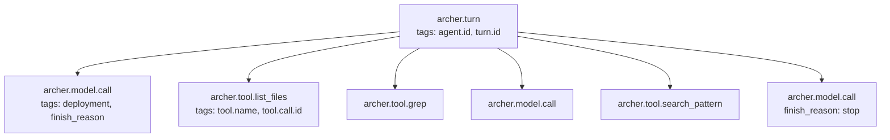

## Archer Telemetry

Archer emits OpenTelemetry traces, metrics, and logs from one place
(`src/Archer.Application/Telemetry/ArcherTelemetry.cs`) and configures the
exporters from another (`src/Archer.Host/OtelConfig.cs`). The host calls
`AddArcherTelemetry` while building services (`ArcherHostBuilder.cs:77`),
so every entrypoint — `archer`, `archer-tui`, integration tests — gets the
same wiring with no extra code.

If you only want to see traces locally, jump to
[Local Jaeger one-liner](#local-jaeger-one-liner).

### What is instrumented

Three call sites emit Archer-native spans:

| Span name              | Where                                                                                  | Kind     |
|------------------------|----------------------------------------------------------------------------------------|----------|
| `archer.turn`          | `src/Archer.Actors/Grains/TurnWorkerGrain.cs:67-69`                                    | Internal |
| `archer.model.call`    | `src/Archer.Model/AgentFramework/AgentFrameworkModelTurnRunner.cs:85-87`               | Client   |
| `archer.tool.<name>`   | `src/Archer.Actors/Grains/TurnWorkerGrain.cs:198-200` (one per tool call)              | Internal |

The host also pulls in additional sources at `OtelConfig.cs:55-57`:

- `Microsoft.Orleans.Runtime`
- `Microsoft.Orleans.Application`
- `Azure.*` (Azure SDK auto-instrumentation, including the AOAI client)

### ActivitySource and Meter

Both share the name `Archer` (`ArcherTelemetry.cs:13-17`):

```csharp
public const string SourceName = "Archer";
public const string MeterName  = "Archer";
public static readonly ActivitySource ActivitySource = new(SourceName);
public static readonly Meter Meter = new(MeterName);
```

If you add a new instrument, register it on `ArcherTelemetry.Meter` so the
existing `mp.AddMeter(ArcherTelemetry.MeterName)` in `OtelConfig.cs:74` picks
it up automatically.

### Counters and histograms

All defined in `ArcherTelemetry.cs:20-49`:

| Instrument                     | Type           | Unit | Meaning                                                  |
|--------------------------------|----------------|------|----------------------------------------------------------|
| `archer.turns.started`         | Counter<long>  | —    | Turn started (`TurnWorkerGrain.cs:72`)                   |
| `archer.turns.completed`       | Counter<long>  | —    | Final answer committed (`TurnWorkerGrain.cs:162`)         |
| `archer.turns.superseded`      | Counter<long>  | —    | Turn superseded by a newer message (`TurnWorkerGrain.cs:167`) |
| `archer.turns.failed`          | Counter<long>  | —    | Turn ended with an error (`TurnWorkerGrain.cs:275`)      |
| `archer.tool.calls`            | Counter<long>  | —    | Tool invocation issued (`TurnWorkerGrain.cs:206`)        |
| `archer.tool.duration`         | Histogram<double> | ms | Tool execution duration (`TurnWorkerGrain.cs:219`)       |
| `archer.model.call.duration`   | Histogram<double> | ms | Model call duration (`AgentFrameworkModelTurnRunner.cs:112`) |
| `archer.model.errors`          | Counter<long>  | —    | Model call returned an error (`AgentFrameworkModelTurnRunner.cs:106`) |

Runtime metrics (GC, threadpool, lock contention) are also added via
`mp.AddRuntimeInstrumentation()` (`OtelConfig.cs:75`).

### Standard tag keys

`ArcherTelemetry.Tags` (`ArcherTelemetry.cs:52-61`) — apply these consistently
on any new span:

| Constant            | Key                          | Where it's set                                      |
|---------------------|------------------------------|------------------------------------------------------|
| `Tags.AgentId`      | `archer.agent.id`            | Turn / tool / model spans                            |
| `Tags.AgentDefinition` | `archer.agent.definition` | Reserved for `code-scout` etc. (set on agent spans)  |
| `Tags.TurnId`       | `archer.turn.id`             | Turn / tool / model spans                            |
| `Tags.ToolName`     | `archer.tool.name`           | `archer.tool.<name>` spans + tool counters/histograms |
| `Tags.ToolCallId`   | `archer.tool.call.id`        | `archer.tool.<name>` spans                           |
| `Tags.Deployment`   | `archer.model.deployment`    | `archer.model.call` spans + model counter/histogram  |
| `Tags.FinishReason` | `archer.model.finish_reason` | `archer.model.call` span tag (e.g. `stop`, `length`) |

The same keys are used as histogram tags so you can `group by` cleanly in
Prometheus/Grafana.

### Trace tree per turn



One `archer.turn` span wraps the entire iterative model+tool loop. Each
iteration adds one `archer.model.call` and zero-or-more `archer.tool.<name>`
spans as siblings. Spans are emitted with `using var span = …StartActivity(…)`
(`TurnWorkerGrain.cs:67`, `:198`,
`AgentFrameworkModelTurnRunner.cs:85`) so they end on scope exit.

### Configuration — the `Otel:` section

Bound to `OtelConfig.OtelOptions` (`OtelConfig.cs:23-38`):

```jsonc
"Otel": {
  "ServiceName":     "Archer",          // resource attribute service.name (default: Archer)
  "Endpoint":        null,              // when set, OTLP exporter is enabled
  "Protocol":        "grpc",            // "grpc" (default) or "httpprotobuf"
  "ConsoleExporter": false              // also emit to the console — debug aid
}
```

Behaviour:

- **No exporter configured** — instruments and spans are still created (cheap),
  but nothing is shipped. `AddArcherTelemetry` is always called from the host.
- **`Endpoint` set** — OTLP exporter is added for **traces, metrics, and
  logs** (`OtelConfig.cs:64-90` and `:104-109`).
- **`ConsoleExporter: true`** — adds the console exporter alongside whatever
  else is configured. Useful while iterating on instrumentation locally.

The protocol mapping: `"httpprotobuf"` → `OtlpExportProtocol.HttpProtobuf`,
anything else → `OtlpExportProtocol.Grpc` (`OtelConfig.cs:116-119`).

`appsettings.Development.json` snippet to point at a local Jaeger:

```jsonc
{
  "Otel": {
    "ServiceName":     "Archer",
    "Endpoint":        "http://localhost:4317",
    "Protocol":        "grpc",
    "ConsoleExporter": false
  }
}
```

You can also drive it from the environment using the `CODESCOUT_` prefix that
the host registers (see [CONFIGURATION.md](./CONFIGURATION.md)):

```bash
export CODESCOUT_Otel__Endpoint=http://localhost:4317
export CODESCOUT_Otel__Protocol=grpc
```

### Local Jaeger one-liner

The fastest path to "I want to see a trace right now":

```bash
docker run --rm --name jaeger \
  -p 16686:16686 \
  -p 4317:4317 \
  -p 4318:4318 \
  jaegertracing/all-in-one:latest
```

Then add the `Otel` block above to your `appsettings.Development.json` and
launch `archer` or `archer-tui`. Open the UI at <http://localhost:16686>,
select **service: Archer**, hit Find Traces, and click any `archer.turn` span
to see the full tool/model breakdown.

### docker-compose: Jaeger + Prometheus + Grafana

For a fuller setup that also captures metrics, save as
`docker/otel-stack.yml`:

```yaml
services:
  jaeger:
    image: jaegertracing/all-in-one:latest
    ports:
      - "16686:16686"   # UI
      - "4317:4317"     # OTLP grpc
      - "4318:4318"     # OTLP http
    environment:
      COLLECTOR_OTLP_ENABLED: "true"

  prometheus:
    image: prom/prometheus:latest
    ports:
      - "9090:9090"
    volumes:
      - ./prometheus.yml:/etc/prometheus/prometheus.yml:ro

  otel-collector:
    image: otel/opentelemetry-collector-contrib:latest
    command: ["--config=/etc/otel/config.yaml"]
    ports:
      - "4319:4317"     # OTLP grpc (Archer points here)
    volumes:
      - ./otel-collector.yaml:/etc/otel/config.yaml:ro
    depends_on: [jaeger, prometheus]

  grafana:
    image: grafana/grafana:latest
    ports:
      - "3000:3000"
    environment:
      GF_AUTH_ANONYMOUS_ENABLED: "true"
      GF_AUTH_ANONYMOUS_ORG_ROLE: "Admin"
    depends_on: [prometheus]
```

`otel-collector.yaml`:

```yaml
receivers:
  otlp:
    protocols:
      grpc:

exporters:
  otlp/jaeger:
    endpoint: jaeger:4317
    tls: { insecure: true }
  prometheus:
    endpoint: 0.0.0.0:8889

service:
  pipelines:
    traces:
      receivers: [otlp]
      exporters: [otlp/jaeger]
    metrics:
      receivers: [otlp]
      exporters: [prometheus]
```

`prometheus.yml`:

```yaml
scrape_configs:
  - job_name: otel
    static_configs:
      - targets: ["otel-collector:8889"]
```

Then point Archer at the collector:

```jsonc
{
  "Otel": {
    "Endpoint": "http://localhost:4319",
    "Protocol": "grpc"
  }
}
```

Bring it up:

```bash
docker compose -f docker/otel-stack.yml up -d
```

- Traces: <http://localhost:16686> (Jaeger UI)
- Metrics: <http://localhost:9090> (Prometheus) — query e.g.
  `histogram_quantile(0.95, rate(archer_model_call_duration_bucket[5m]))`
- Dashboards: <http://localhost:3000> (Grafana, anonymous admin)

### Suggested Grafana panels

A starting set of PromQL queries (Prometheus-flavoured names — dots become
underscores):

| Panel                              | Query                                                                                       |
|------------------------------------|---------------------------------------------------------------------------------------------|
| Turns per minute (by outcome)      | `sum by (le) (rate(archer_turns_started_total[1m]))` paired with `archer_turns_completed_total`, `archer_turns_failed_total`, `archer_turns_superseded_total` |
| Turn outcome ratio                 | `rate(archer_turns_completed_total[5m]) / rate(archer_turns_started_total[5m])`             |
| p95 model latency                  | `histogram_quantile(0.95, sum by (le) (rate(archer_model_call_duration_bucket[5m])))`        |
| p95 tool latency by tool           | `histogram_quantile(0.95, sum by (le, archer_tool_name) (rate(archer_tool_duration_bucket[5m])))` |
| Model error rate                   | `rate(archer_model_errors_total[5m])`                                                       |
| Tool calls by name                 | `sum by (archer_tool_name) (rate(archer_tool_calls_total[5m]))`                              |

### .NET Aspire (recommended local workflow)

.NET Aspire will be the recommended local OTel workflow for Archer — one
`AppHost` resource brings up Jaeger, Prometheus, Grafana, and the Archer host
with the right env vars wired in. The detailed walkthrough lives in
[ASPIRE.md](./ASPIRE.md) (**TODO** — not yet written; until it lands, use the
docker-compose stack above).

### Adding instrumentation

To add a new metric, attach it to `ArcherTelemetry.Meter`:

```csharp
public static readonly Counter<long> SomethingHappened =
    Meter.CreateCounter<long>("archer.something.happened",
        description: "What happened.");
```

It will be picked up automatically because `OtelConfig.cs:74` adds the meter
by name.

To add a new span, use the shared `ActivitySource`:

```csharp
using var span = ArcherTelemetry.ActivitySource.StartActivity(
    "archer.something",
    ActivityKind.Internal);
span?.SetTag(ArcherTelemetry.Tags.AgentId, agentId);
```

Stick to the existing tag constants where possible (`ArcherTelemetry.Tags`)
so cross-instrument joins keep working.

### See also

- [CLI.md](./CLI.md) — instrumentation is shared with the CLI host
- [TUI.md](./TUI.md) — the TUI uses the same telemetry
- [CONFIGURATION.md](./CONFIGURATION.md) — `Otel` section sits alongside
  `AzureOpenAI`, `Persistence`, `Tools`, and `TurnWorker`
- ARCHITECTURE.md *(TODO — not yet written; will cover the turn pipeline that
  these spans wrap)*
- ASPIRE.md *(TODO — local Aspire AppHost for OTel)*
